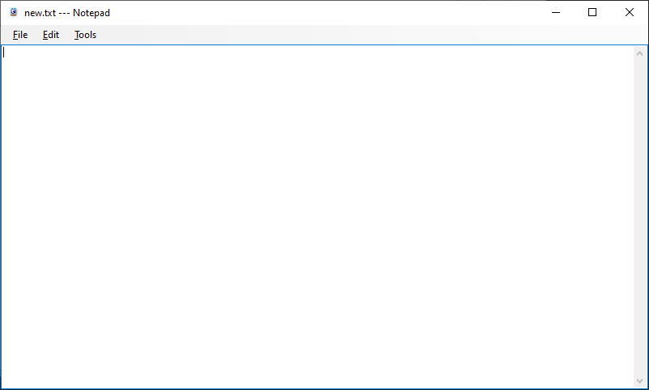
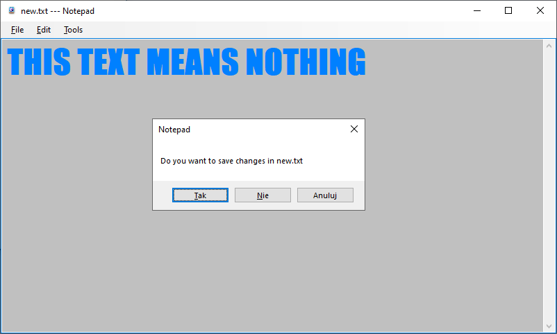

# Notepad

## Table of contents
* [General info](#general-info)
* [Technologies](#technologies)
* [Images](#images)

## General info
I did it to learn Windows Forms using .Net. For now it's just a copy of Windows Notepad but in the future
I will improve it a lot. For now working only first "File" menu button and "undo" and "redo"
from second menu button "Edit". I will regulary update it.

## Technologies
Project is created with:
* C#
* Visual Studio 2019
* Windows Forms App

## Images

